# Great Escapes, G-Travel

## Milestone Project 2

- The aim of this project is to build an interactive front end website using HTML CSS and javaScript.
- I have decided to build a website for a fictional travel company G-Travel. I have used the knowledge I've learned in the course to date as well as good good user experience to create a responsive, well designed functional website.

## Live project

- [View the live project here.](https://brianwhelandublin.github.io/milestone-project-2/)

## User experience

### User Stories

- New Visitor

  - As a new user I would like to get information about the company.
  - As a new user I would like to see what destinations the company travel too.
  - As a new user I would like to see information about each destination.
  - As a new user I would like to sign up to a newsletter.

- Repeat users

  - As a repeat user I would like to book a package.
  - As a repeat user I would like to be able to contact the company.
  - As a repeat user I would like to be able to see the companies social media.

- Regular Visitor

  - As a repeat user I would like to see if there are any new packages.
  - As a repeat visitor I would like to be able to see what the travel packages the company does.
  - As a repeat user I would like to see reviews before I decide to book.

- Website owner
- As the owner I want my customers to be able to find information easily.
- As the owner I want my customers to be able to book holiday packages.
- As the owner I want my customers to be able to contact me easily by whichever means they choose.

### WireFrames

- I've crated WireFrames using Balsamiq and have included a link here to access them here in pdf form.

## Design

#### Colour Scheme

- I've created a dark theme for this website using a dark russian black #181822 as my main background colour. My text is an off white #fafafb to contrast against the dark background.
  I have alternated the colours on hover effects too to show the user what elements are clickable.

#### Typography

- I've used one font in different weights for headings and text element across the site to create a uniform theme throughout all the text.
  Ive imported the Mulish font to my css stylesheet from Google Fonts.
  I used sans-serif as a fall-back font in case for any reason my fonts were not imported.

#### Imagery

- Imagery was very important to me and I choose images that conveyed the feel of the company throughout I tried to choose images of well known landmarks for each destination also.
  I used images as backgrounds to help separate sections and placed slightly opaque elements overtime. This also helped to soften the dark background.
  I sourced all my images from unsplash.

#### Icons

- I used line awesome for icons for social media links which I've included in the footer.

## Features

## Technologies used

### Languages Used.

- [HTML5](https://en.wikipedia.org/wiki/HTML5)

  - HTML5 was used to create the content and base of each page.

- [CSS3](https://en.wikipedia.org/wiki/CSS)

  - CSS3 was used to then style the page and make it responive through media querys, and interactive through using css transitions.

- [javaScript](https://en.wikipedia.org/wiki/JavaScript)
  - javaScript was used throughout the website to make the site interactive. The javaScript will change what is being shown to the user depending on what they click.

### Frameworks Libraries and Programs.

- [Bootstrap 4](https://getbootstrap.com/)
  - I used bootstrap throughout the site to make it responsive. I also used bootstrap to create the booking forms, and the modals pop up when the forms have been submited.
- [Google Fonts](https://fonts.google.com/)
  - I imported the Mulish font from google fonts and used it consistently across the site.
- [Line awesome](https://icons8.com/line-awesome)

  - I used different icons from Line awesome throughout the site for social media links and for some back links to improve user experience.

- [Lightsilder](http://sachinchoolur.github.io/lightslider/)

  - I used Lightslider to create the responsive destinations slider on my home page.

- [Git](https://git-scm.com/)

  - Git was used as a version control in the terminal.

- [Github](https://github.com/)

  - Github was used to create and store the project repository.

- [Gitpod](https://gitpod.io/)

  - Gitpod was used to create my files and code the project.

- [Balsamiq](https://balsamiq.com/)

  - Balsamiq was used to create Wireframes for the project during the initial planning stage.

- [Am I responsive](http://ami.responsivedesign.is/)

  - Am i responsive was used to take screenshots of the page at different screen sizes.

- [jQuery](https://jquery.com/)
  - jQuery was used for the Rest Countries Api call and for the Lightslider.

### Application Programming Interface (Api's)

- [Rest Countries](https://restcountries.eu/)

  - I used the Rest Countries Api on my destination page to get details for each destination. I used the data for the countrymap, its capital, region, language and currency and rendered it to the page for each different destination.

- [Google Maps Api](https://cloud.google.com/maps-platform)

  - I used the google maps api to render a map for each destination on the destination page. I set each destinations coordinates and zoom in the destination object which then tailored the map for each destination.

- [Google maps Places Library](https://developers.google.com/maps/documentation/javascript/places/)

  - I used the Google Maps places library to do a nearby search of popular attractions for each destination. The user can choose from a list of attractions and they will be shown on the map.

- [Marker Cluster Plus](https://github.com/googlemaps/js-markerclustererplus)

  - I used the Marker Cluster Plus library from Google Maps to place cluster markers on each map. This keeps the map less cluttered when performing a search but lets the user know there is a number of places in a specific area.

- [EmailJS](https://www.emailjs.com/)
  - EmailJS was used for all forms including the contact form and the booking enquiry form. The newsletter form will also send an attomatic reply to thank the user for signing up.

## Testing

## Deployment

### Github, Gitpod, Git and Gitub pages

- #### To start the project I used Github and Gitpod.

  1. I first signed into Github and located the Code Institute Gitpod template.

     - 

  2. I then clicked the use this template button.

     - 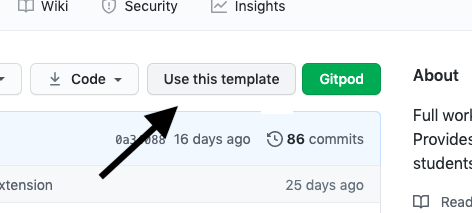

  3. I then named the repository and created it.

     - 

  4. Once the repository was created I could then open it on Gitpod.

  5. I the used my terminal to create my files and folders. I started with my index.html.

     - 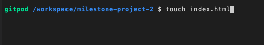

  6. Then my assets folder.

     - 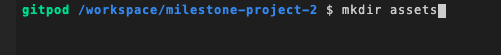

  7. I used the same steps to create my css folder,images folder, style.css file, my javascript js folder and my main.js file.

  8. Once all files were created I then used the git add command to add them to the staging area.

     - 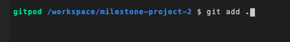

  9. I then used git commit command to add commit the files using initial commit as my comment.

     - 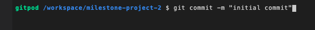

  10. I then used git push to push them all to Github.

      - 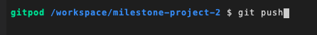

  11. Once this was completed I was able to start work on the project.

- #### Git

  1. Throughout the project I used git to save and store my progress.

  2. Once I completed a section I used git add command to add the changes I had made to the staging area.

     - 

  3. Once the file was staged I the used the git commit command to commit the changes.

     - 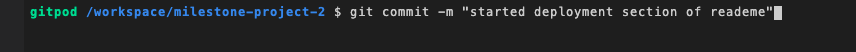.

  4. Then the changes were pushed to Github using git push command.

  - 

  5. The above steps were used for each stage of development throught the project.

- #### To make my project live I then used Github pages.

  1. I First signed into my Github and located my project repository.

  2. At the top of the repository I selected the settings option.

     - 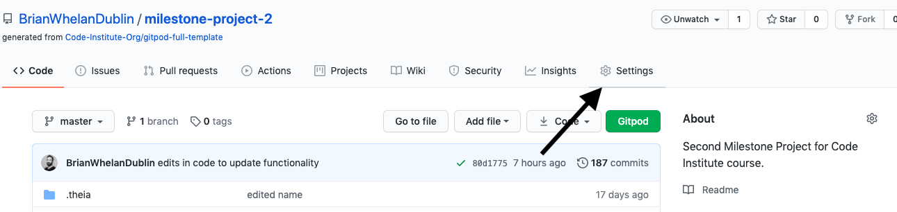

  3. I then scrolled down the page until I reached the Github pages section.

     - 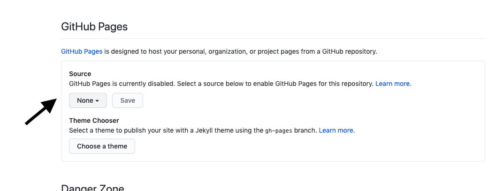

  4. Under sources I then selected the Master Branch.

     - 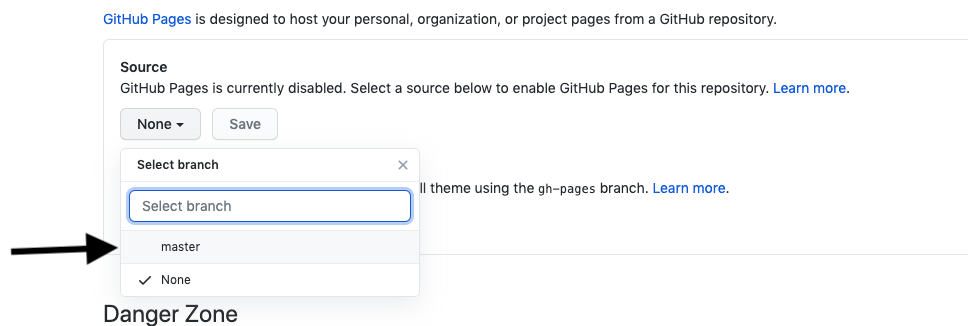

  5. The page then refreshed itself.

  6. I then scrolled back down and the link to my live page was then visible.

     - 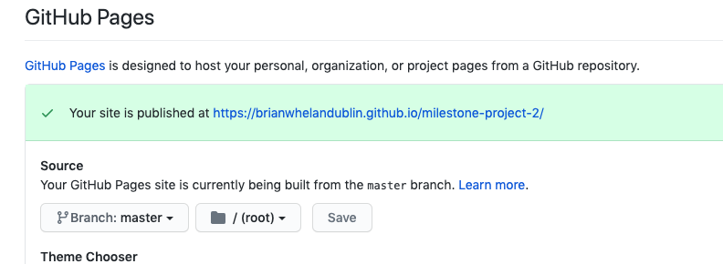

## Credits

### Code

- #### Stack Overflow.

  - [Centre Divs](https://stackoverflow.com/questions/1776915/how-can-i-center-an-absolutely-positioned-element-in-a-div)

    - I used code from the above link to completely centre a div.I have disscussed this in more detail in the testing section.

  - [Fixing the css transitions on load](https://stackoverflow.com/questions/22744438/remove-body-class-after-window-load-with-javascript)

    - I used code from the above link to fix an issue I had with my css transitions running on page load.

  - [Working with markerclusters](https://stackoverflow.com/questions/18945314/google-maps-markerclusterer-either-doesnt-work-or-hides-all-markers)

    - I used the above code to fix an issue I had with the marker clusterer in google maps. The answer included pushing the markers into an array before assigning them to the markerclusterer function which I then used.

- #### You tube Tutorials.

  - I used two main tutorials on youtube to learn to have an interactive navbar and also how to fade elements in upon scrolling. I have used some elements of the code but have edited it to fit this website.

    - ##### Code and Create youtube tutorial.

      - [Navigation bar](https://www.youtube.com/watch?v=9Q7wy8r3i8w&list=WL&index=2)

        - I used the above tutorial on you tube to inspire my navbar. I have edited the code to adapt to my website design. I also have edited the javascript to fix an issue with the nav background not disappearing when a link is clicked . I have discussed this in more detail in the testing section.

    - ##### Dev Ed Visual effects in javascript tutorial.

      - [Visual effects javascript](https://www.youtube.com/watch?v=C_JKlr4WKKs&list=PLDyQo7g0_nsXlSfuoBpG5Fgz0Qe3IvWnA&index=2)

        - I used the above tutorial to add the effect of my elements fading in upon page scroll. In the tutorial the code was used for only one element to use it throughout the page I have edited the code by using the querySelectorAll on the animation-element class. I then added the .forEach() function so the code work work for any element with the class of animation element.

- #### Code Institute.

  - [My Version of the walkthrough project](https://github.com/BrianWhelanDublin/resume-walkthrough-project)

    - I used the Code Institue resume project to help me with using the emailJS code and also for calling the rest countries Api using jQuery.

- #### Google Maps Documentation.

  - [Google Maps javascript Api Documentation](https://developers.google.com/maps/documentation/javascript/overview)

    - I used the documentation from google maps to get an overview of
      1. How to add google maps into your html.
      2. How to create a map.
      3. The basics of how to use map cluster.

  - [Google Places Library Documentation](https://developers.google.com/maps/documentation/javascript/places)

    - I used the Google Map Places Library documentation to learn the basics of calling a nearby search on my map.

  - [Google Code Labs](https://codelabs.developers.google.com/codelabs/google-maps-nearby-search-js?hl=en#0)

    - I used code form the Build a Nearby Business Search service with Google Maps Platform tutorial on google codelabs.
    - I used this tutorial to help me understand an implement a search on my map.
    - I've edited the code to search for a type of place depending on which button the user picks.
    - I also added google maps marker clustering to make my map look cleaner.
    - I created two functions to clear the map of Markers and then Marker clustering when a new button is clicked.

    - I rewrote the showPanel function to work with this website and to render the results of the search to the website when a marker is clicked.
    - I've also edited the showDetails function to use Template literals and to add classes for font-size and color.

### Content 

  - All Text for the website was written by myself.

### Media 

  - [Unsplash](https://unsplash.com/)
    - All images for the website were obtained from unsplash.

### Acknowledgements

   - Code Institute for getting me to this point

   - My Mentor for his help with this project.