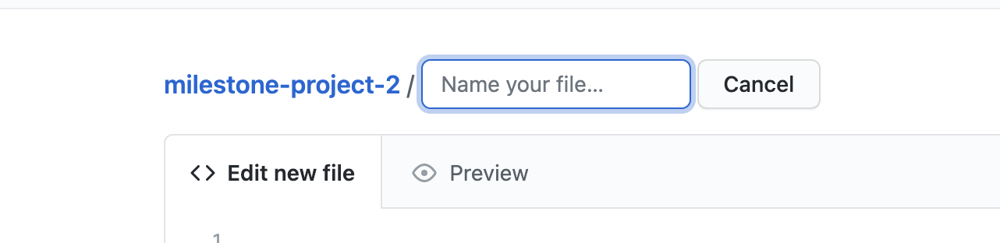

# Great Escapes, G-Travel

## Milestone Project 2

- The aim of this project is to build an interactive front end website using HTML CSS and javaScript.
- I have decided to build a website for a fictional travel company G-Travel. I have used the knowledge I've learned in the course to date as well as good good user experience to create a responsive, well designed functional website.
- My web page consists of:
  - A landing page containing the company information, all the destinations the company travels to, customer reviews, special offers, newsletter sign up and a simple contact form and contact details. My footer contains the social media links.
  - Each destination then fills out the destination page with a title section, information about the destination, a map with search capabilities for local attractions and destination packages section.
  - They packages then lead to a booking enquiry form which can be filled out and sent to make a booking enquiry.

## Live project

- [View the live project here.](https://brianwhelandublin.github.io/milestone-project-2/)

## Screenshots

### Home page screenshot

### Destination page screenshot

### Booking Enquiry form screenshot

- All screen shots created using [Am I responsive](http://ami.responsivedesign.is/)

## Table of Contents.

  * [User experience](#user-experience)
    + [User Stories](#user-stories)
    + [WireFrames](#wireframes)
  * [Design](#design)
      - [Colour Scheme](#colour-scheme)
      - [Typography](#typography)
      - [Imagery](#imagery)
      - [Icons](#icons)
  * [Features](#features)
    + [Landing Page Features.](#landing-page-features)
      - [navbar](#navbar)
      - [Destination Sliders](#destination-sliders)
      - [Reviews](#reviews)
      - [Special packages](#special-packages)
      - [Newsletter](#newsletter)
      - [Contact Form](#contact-form)
    + [Destination Page Features](#destination-page-features)
      - [Destination page](#destination-page)
      - [Heading section](#heading-section)
      - [Destination Navbar](#destination-navbar)
      - [Destination details.](#destination-details)
      - [Destination Map.](#destination-map)
      - [Destination packages](#destination-packages)
      - [Destination Error](#destination-error)
    + [Booking Enquiry Form](#booking-enquiry-form)
      - [The booking enquiry form](#the-booking-enquiry-form)
      - [Booking Enquiry Navigation.](#booking-enquiry-navigation)
      - [Booking modal](#booking-modal)
      - [Booking Enquiry Error](#booking-enquiry-error)
      - [404 error page.](#404-error-page)
  * [Technologies used](#technologies-used)
    + [Languages Used.](#languages-used)
    + [Frameworks Libraries and Programs.](#frameworks-libraries-and-programs)
    + [Application Programming Interface (Api's)](#application-programming-interface--api-s-)
  * [Testing](#testing)
  * [Deployment](#deployment)
    + [Github, Gitpod, Git and Gitub pages](#github--gitpod--git-and-gitub-pages)
      - [To start the project I used Github and Gitpod.](#to-start-the-project-i-used-github-and-gitpod)
      - [Git](#git)
      - [To make my project live I then used Github pages.](#to-make-my-project-live-i-then-used-github-pages)
  * [Credits](#credits)
    + [Code](#code)
      - [Stack Overflow.](#stack-overflow)
      - [You tube Tutorials.](#you-tube-tutorials)
        * [Code and Create youtube tutorial.](#code-and-create-youtube-tutorial)
        * [Dev Ed Visual effects in javascript tutorial.](#dev-ed-visual-effects-in-javascript-tutorial)
      - [Code Institute.](#code-institute)
      - [Google Maps Documentation.](#google-maps-documentation)
    + [Content](#content)
    + [Media](#media)
    + [Acknowledgements](#acknowledgements)

<small><i><a href='http://ecotrust-canada.github.io/markdown-toc/'>Table of contents generated with markdown-toc</a></i></small>

## User experience

### User Stories

- New Visitor
  - As a new user I would like to know what the company does upon open the site.
  - As a new user I would like to get information about the company.
  - As a new user I would like to see what destinations the company travel too.
  - As a new user I would like to see information about each destination.
  - As a new user I would like to sign up to a newsletter.
  - As a new user I would like to easily get around the website.

- Repeat users

  - As a repeat user I would like to make a booking enquiry.
  - As a repeat user I would like to be able to contact the company.
  - As a repeat user I would like to send a contact message.
  - As a repeat user I would like to be able to see the companies social media.
  - As a repeat user I would like to be able to search for local attractions for each destination.

- Regular Visitor

  - As a regular user I would like to see if there are any new offers.
  - As a regular visitor I would like to be able to see what the travel packages the company does.
  - As a regular user I would like to see reviews before I decide to book.
  
- Website owner

  - As the owner I want my customers to be able to find information easily.
  - As the owner I want my customers to be able to enquire aboutholiday packages.
  - As the owner I want my customers to be able to contact me easily by whichever means they choose.
  - As a site owner I want my customers to be able to navigate back to all destinations from the destination page.
  - As a site owner I want my customers to be able to navigate back to there chosen destination from the booking enquiry form.

### WireFrames

- I've crated WireFrames using Balsamiq and have included the links to access them in pdf form.
  
  - Landing page
    - [Desktop](assets/wireframes/landingpage-desktop-wireframe.pdf)
    - [Tablet](assets/wireframes/landingpage-tablet-wireframe.pdf)
    - [Phone](assets/wireframes/landingpage-phone-wireframe.pdf)
  - Destination page
    - [Desktop](assets/wireframes/destinationpage-desktop.pdf)
    - [Tablet](assets/wireframes/destinationpage-tablet.pdf)
    - [Phone](assets/wireframes/destinationpage-phone.pdf)
  - Booking page
    - [Desktop](assets/wireframes/landingpage-desktop.pdf)
    - [Tablet](assets/wireframes/landingpage-tablet.pdf)
    - [Phone](assets/wireframes/landingpage-phone.pdf)

## Design

#### Colour Scheme

- I've created a dark theme for this website using a dark russian black #181822 as my main background colour. My text is an off white #fafafb to contrast against the dark background.
  I have alternated the colours on hover effects too to show the user what elements are clickable.
   - 

#### Typography

- I've used one font in different weights for headings and text element across the site to create a uniform theme throughout all the text.
  I,ve imported the Mulish font to my css stylesheet from Google Fonts.
  I used sans-serif as a fall-back font in case for any reason my fonts were not imported.
   - - 

#### Imagery

- Imagery was very important to me and I choose images that conveyed the feel of the company throughout. I tried to choose images of well known landmarks for each destination also.
  I used images as backgrounds to help separate sections and placed a slightly opaque element over them to conatain the text. This also helped to soften the dark background.
  I sourced all my images from unsplash.

#### Icons

- I used line awesome for icons for social media links which I've included in the footer. I've also used arrows on some links to help draw attention to them and to show the user they are clickable.

## Features

### Landing Page Features.

 -  #### navbar
   - With the help of Code and Create youtube tutorial (details in the credit section) I have created a hamburger menu. The navbar appears on click of the hamburger and then dissapears on a click of the x. The navbar also disapears when you click an option in the list. The list items background colour and text colour also change on hover.
     - To Open navbar 
       - 
     - Opened navbar 
       - 
     - Nav item hover
       - 

  - #### Destination Sliders
    - Using lightslider (details in technologies used section) I have created two lists of destinations. One city destinations and two beach destinations. The destination details are pulled from a javascript array od destination objects I have created. To add new destinations in the future or to change destination details you simply have to edit the perticular object in the array.
      - City Destinations
        - 
      - Beach Destinations
        - 

  - #### Reviews 
    - The reviews section features 3 reviews by different customers. On page opening one review is shown with the customers name who wrote the review highlighted with a box shadow to show the user the review was written by them. On click of the next person their review will then be shown and their name highlighted. I have also added directional arrows to encourage users to click.
      - Review on open 
        -
      - Second customer clicked
        - 

 - #### Special packages
   - This feature can be used by the site owner to showcase packages to the user that are on special offer.
     - Special packages section
       -

 - #### Newsletter 
   - This feature allows the user to sign up for a company newsletter. I have used emailJS here to send an email to the site owner and a reply to the user. I have also used bootstrap to show a modal on a sucessful submit to thank the user for signing up. If there was an error the site will alert the user that something has gone wrong and to please try again.
     - Newsletter section. 
       - 
     - Sucessfully submited.
       - 
     - Error message
       - 

 - #### Contact Form 
    - The contact section contains a small contact form for the user to contact the company. It is also connected to emailJs sending a message to the site owner. It waill also show a modal on successful completion and an error if something goes wrong.
     -  Contact Form.
       - 
      -  Sucessfully submited.
       - 
     - Error message
       - 
        
### Destination Page Features 
  
  - #### Destination page 
    - When a user clicks on a destination on the landing page it brings you to the destination page. All destinations have a unique code and by grabbing that code from the pages url I have written code to fill the page differently for every destination. 

- #### Heading section
  - Each page has a unique image and title for each destination. I've included images from one city destination and one beach destination there are 10 in cities and 10 beaches in total.
     - Kyoto Page
       - 
     - Fiji Page
       - 
  
- #### Destination Navbar
  - The destination navbar has been coded to change for each destination. 
    - Kyoto Navbar
       - 
     - Fiji Navbar
       - 

- #### Destination details.
   - The destination details section take data from the rest countries Api and fills the details depending on the destination. I've included the country flag, it's capital and region, and it's language and currency. There is also a short description for each destination takeing from the array i have created.
     - Kyoto Details Section
       - 
     - Fiji Details Section
       - 
       
- #### Destination Map.
  - The destination Map section uses the Google maps Api with the Google Places Library and the Marker Clusterer library. The map changes for each destination. The user is then provided with 5 buttons with different types of attractions to click. The buttons change colour on hover to encourage clicking. Once clicked the map will show the top 20 attractions with a marker. You can the click on each marker to show the result.
  - Map Section
       - 
  - Map section When button Presses
       - 
  - Map section result when marker pressed
       - 

- #### Destination packages
  - Each destination has 3 different packages a 3 star, 4 star and 5 star and each link to the booking enquiry form.
    - Destination Packages Section
       - 

- #### Destination Error 
  - If for somereason a user gets to the destination page without a destination code in the url or a wrong destination code the page will fill with an error to tell the user there has been no destination found. It also contains a lik to the homepage where the user can pick a destination.
    - Destination error 
      - 

### Booking Enquiry Form 

  - #### The booking enquiry form 
    - This page allows the user to fill out and submit an enquiry to book a package. The main page links to an empty form. The destination page links to the form with the destination prefilled out. If the user clicks on a destination packed the forms destination and package input will be pre filled out also. The package input is not required to allow the user that the user might only want to enquire about a destination only.
      -  Empty Form
        - 
      - Destination prefilled
        - 
      -  Destination and Package pre filled
        - 

  - #### Booking Enquiry Navigation.
    - The navigation on the booking enquiry page will change depending on a two factors. If you come to this page from the home page it will have a general navigation that links back to the home page. If you come to it from a destiination it will link bacjk to that destinations page an its packages.
      - General Navbar
        - 
      - Navbar with a destination
        - 
     
  - #### Booking modal
    - The booking enquiry form uses emailjs to send the details to the buisness owner. Upon completion of the form a modal pops up to let the user know someone will be in touch with them soon.
      - Modal on form submit
        - 

  - #### Booking Enquiry Error
    - If for whatever reason an error occurs the booking for will alert the user.
      -  Booking Enquiry Error.
        -  

### 404 Error Page

 - #### 404 error page. 
   - I've also included a 404 error page with github pages if the user navigates to a wrong url for whatever reason. To do this I did the following:
     1. I first located and clicked the add file button in github.
       -  
     2. Git hub then asks you to name your file.
       - 
     3.  I then named my file 404.html.
       - 
     4. Once these steps were complete then commit the file to your master branch in the project repository with a commit message.
       

### Features left to Implement.

  - In the future I could expand on the website adding a booking feature to book packages directly from the website instead of just enquiring about them.
  - The feature to book flights could also be added.
  - The feature to book different hotels at each destination could be added too.

## Technologies used

### Languages Used.

- [HTML5](https://en.wikipedia.org/wiki/HTML5)

  - HTML5 was used to create the content and base of each page.

- [CSS3](https://en.wikipedia.org/wiki/CSS)

  - CSS3 was used to then style the page and make it responive through media querys, and interactive through using css transitions.

- [javaScript](https://en.wikipedia.org/wiki/JavaScript)
  - javaScript was used throughout the website to make the site interactive. The javaScript will change what is being shown to the user depending on what they click.

### Frameworks Libraries and Programs.

- [Bootstrap 4](https://getbootstrap.com/)
  - I used bootstrap throughout the site to make it responsive. I also used bootstrap to create the booking forms, and the modals pop up when the forms have been submited.

- [Google Fonts](https://fonts.google.com/)

  - I imported the Mulish font from google fonts and used it consistently across the site.

- [Line awesome](https://icons8.com/line-awesome)

  - I used different icons from Line awesome throughout the site for social media links and for some back links to improve user experience.

- [Lightsilder](http://sachinchoolur.github.io/lightslider/)

  - I used Lightslider to create the responsive destinations slider on my home page.

- [Git](https://git-scm.com/)

  - Git was used as a version control in the terminal.

- [Github](https://github.com/)

  - Github was used to create and store the project repository.

- [Gitpod](https://gitpod.io/)

  - Gitpod was used to create my files and code the project.

- [Balsamiq](https://balsamiq.com/)

  - Balsamiq was used to create Wireframes for the project during the initial planning stage.

- [Am I responsive](http://ami.responsivedesign.is/)

  - Am i responsive was used to take screenshots of the page at different screen sizes.

- [jQuery](https://jquery.com/)
  - jQuery was used for the Rest Countries Api call and for the Lightslider.

### Application Programming Interface (Api's)

- [Rest Countries](https://restcountries.eu/)

  - I used the Rest Countries Api on my destination page to get details for each destination. I used the data for the countrymap, its capital, region, language and currency and rendered it to the page for each different destination.

- [Google Maps Api](https://cloud.google.com/maps-platform)

  - I used the google maps api to render a map for each destination on the destination page. I set each destinations coordinates and zoom in the destination object which then tailored the map for each destination.

- [Google maps Places Library](https://developers.google.com/maps/documentation/javascript/places/)

  - I used the Google Maps places library to do a nearby search of popular attractions for each destination. The user can choose from a list of attractions and they will be shown on the map.

- [Marker Cluster Plus](https://github.com/googlemaps/js-markerclustererplus)

  - I used the Marker Cluster Plus library from Google Maps to place cluster markers on each map. This keeps the map less cluttered when performing a search but lets the user know there is a number of places in a specific area.

- [EmailJS](https://www.emailjs.com/)
  - EmailJS was used for all forms including the contact form and the booking enquiry form. The newsletter form will also send an attomatic reply to thank the user for signing up.

## Testing

 - #### Testing.
   - The testing section for this site is located at the following link.
     - [Testing file](testing.md)

## Deployment

### Github, Gitpod, Git and Gitub pages

- #### To start the project I used Github and Gitpod.

  1. I first signed into Github and located the Code Institute Gitpod template.

     - 

  2. I then clicked the use this template button.

     - 

  3. I then named the repository and created it.

     - 

  4. Once the repository was created I could then open it on Gitpod.

  5. I the used my terminal to create my files and folders. I started with my index.html.

     - 

  6. Then my assets folder.

     - 

  7. I used the same steps to create my css folder,images folder, style.css file, my javascript js folder and my main.js file.

  8. Once all files were created I then used the git add command to add them to the staging area.

     - 

  9. I then used git commit command to add commit the files using initial commit as my comment.

     - 

  10. I then used git push to push them all to Github.

      - 

  11. Once this was completed I was able to start work on the project.

- #### Git

  1. Throughout the project I used git to save and store my progress.

  2. Once I completed a section I used git add command to add the changes I had made to the staging area.

     - 

  3. Once the file was staged I the used the git commit command to commit the changes.

     - .

  4. Then the changes were pushed to Github using git push command.

  - 

  5. The above steps were used for each stage of development throught the project.

- #### To make my project live I then used Github pages.

  1. I First signed into my Github and located my project repository.

  2. At the top of the repository I selected the settings option.

     - 

  3. I then scrolled down the page until I reached the Github pages section.

     - 

  4. Under sources I then selected the Master Branch.

     - 

  5. The page then refreshed itself.

  6. I then scrolled back down and the link to my live page was then visible.

     - 

## Credits

### Code

- #### Stack Overflow.

  - [Centre Divs](https://stackoverflow.com/questions/1776915/how-can-i-center-an-absolutely-positioned-element-in-a-div)

    - I used code from the above link to completely centre a div.I have disscussed this in more detail in the testing section.

  - [Fixing the css transitions on load](https://stackoverflow.com/questions/22744438/remove-body-class-after-window-load-with-javascript)

    - I used code from the above link to fix an issue I had with my css transitions running on page load.

  - [Working with markerclusters](https://stackoverflow.com/questions/18945314/google-maps-markerclusterer-either-doesnt-work-or-hides-all-markers)

    - I used the above code to fix an issue I had with the marker clusterer in google maps. The answer included pushing the markers into an array before assigning them to the markerclusterer function which I then used.

- #### You tube Tutorials.

  - I used two main tutorials on youtube to learn to have an interactive navbar and also how to fade elements in upon scrolling. I have used some elements of the code but have edited it to fit this website.

    - ##### Code and Create youtube tutorial.

      - [Navigation bar](https://www.youtube.com/watch?v=9Q7wy8r3i8w&list=WL&index=2)

        - I used the above tutorial on you tube to inspire my navbar. I have edited the code to adapt to my website design. I also have edited the javascript to fix an issue with the nav background not disappearing when a link is clicked . I have discussed this in more detail in the testing section.

    - ##### Dev Ed Visual effects in javascript tutorial.

      - [Visual effects javascript](https://www.youtube.com/watch?v=C_JKlr4WKKs&list=PLDyQo7g0_nsXlSfuoBpG5Fgz0Qe3IvWnA&index=2)

        - I used the above tutorial to add the effect of my elements fading in upon page scroll. In the tutorial the code was used for only one element to use it throughout the page I have edited the code by using the querySelectorAll on the animation-element class. I then added the .forEach() function so the code work work for any element with the class of animation element.

- #### Code Institute.

  - [My Version of the walkthrough project](https://github.com/BrianWhelanDublin/resume-walkthrough-project)

    - I used the Code Institue resume project to help me with using the emailJS code and also for calling the rest countries Api using jQuery.

- #### Google Maps Documentation.

  - [Google Maps javascript Api Documentation](https://developers.google.com/maps/documentation/javascript/overview)

    - I used the documentation from google maps to get an overview of
      1. How to add google maps into your html.
      2. How to create a map.
      3. The basics of how to use map cluster.

  - [Google Places Library Documentation](https://developers.google.com/maps/documentation/javascript/places)

    - I used the Google Map Places Library documentation to learn the basics of calling a nearby search on my map.

  - [Google Code Labs](https://codelabs.developers.google.com/codelabs/google-maps-nearby-search-js?hl=en#0)

    - I used code form the Build a Nearby Business Search service with Google Maps Platform tutorial on google codelabs.
    - I used this tutorial to help me understand an implement a search on my map.
    - I've edited the code to search for a type of place depending on which button the user picks.
    - I also added google maps marker clustering to make my map look cleaner.
    - I created two functions to clear the map of Markers and then Marker clustering when a new button is clicked.

    - I rewrote the showPanel function to work with this website and to render the results of the search to the website when a marker is clicked.
    - I've also edited the showDetails function to use Template literals and to add classes for font-size and color.

### Content 

  - All Text for the website was written by myself.

### Media 

  - [Unsplash](https://unsplash.com/)
    - All images for the website were obtained from unsplash.

### Acknowledgements

   - Code Institute for getting me to this point

   - My Mentor for his help with this project.