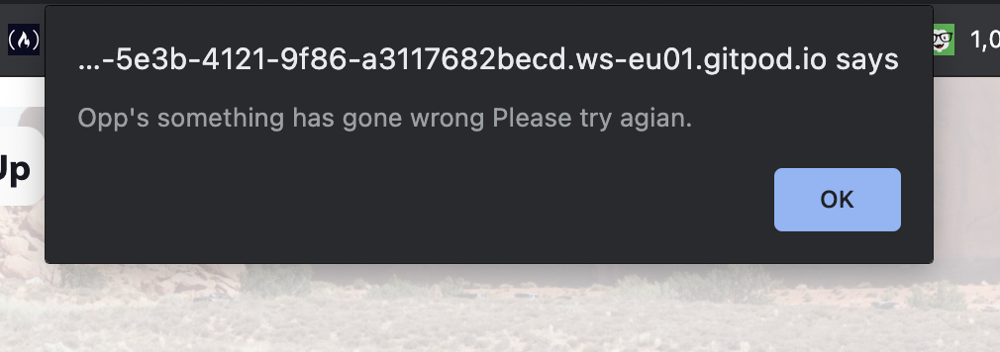
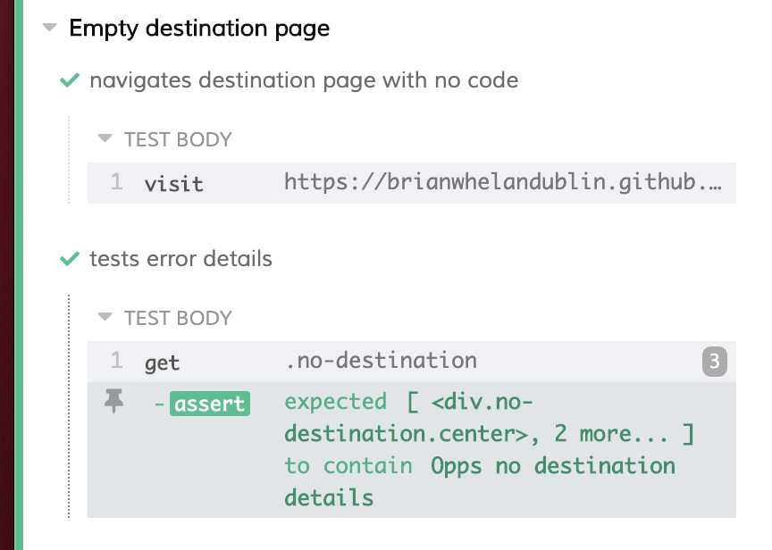
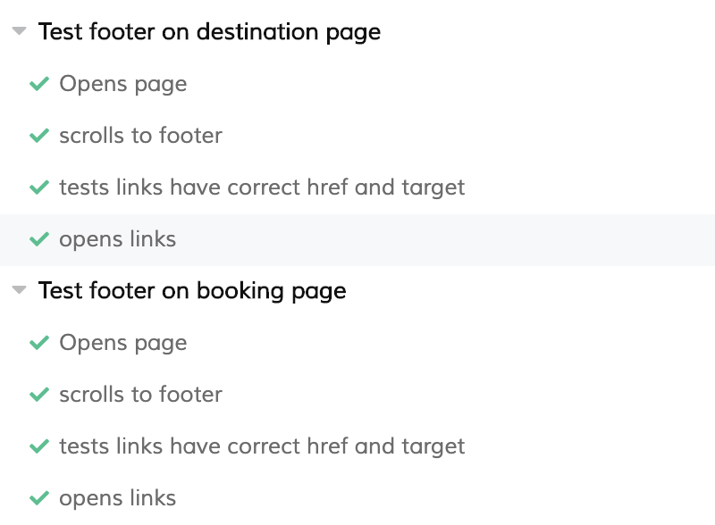

# Testing Section

- In this section, I will document the testing procedure I have completed for the project.

## User Stories.

- New Visitor

  - As a new user I would like to know what the company does upon open the site.

    - The title of the website contains information to inform the user that the website is for a travel company. The company logo is also in a fixed position in the top right-hand corner.
    - The text also contains a link entitled "find out more" which then links to the about section on the landing page.

  - As a new user I would like to get information about the company.

    - The landing page contains an about section upon scrolling after the heading section with information about the company.
    - The user can get to this information by scrolling or by clicking the "find out more" link or by clicking the "about" link in the navigation.

  - As a new user I would like to see what destinations the company travels to.

    - Upon scrolling down the homepage the user is presented with two sliders contain the company destinations.
    - This section has a very clear title "Our Destinations"
    - Both sliders are also very clearly titled,
      1.  "City Destinations"
      2.  "Beach Destinations"
    - Each destination is then clearly labelled within the slider.
    - The slider then contains arrows so the user knows there are more destinations.

  - As a new user I would like to see information about each destination.

    - Each destination in the slider contains a link to its page.
    - This link is clearly labelled with suggestive language, "Find Out More".
    - The link also has a hover effect to show it's clickable.
    - Once clicked the user will be brought to the destination page which will fill with information unique to each destination.

  - As a new user I would like to sign up for a newsletter.

    - Upon scrolling down the Landing page the user will come to the newsletter section.
    - This section is clearly labelled as "Sign up for our newsletter".
    - It contains an email input with a placeholder of email.
    - Once the user fills out their email and clicks the "Sign Up" button they will receive a message pop up thanking them for signing up.
    - EmailJS will then send the site owner and the user an email.
    - If there is an issue the user will be alerted with an error message.

  - As a new user I would like to easily get around the website.
    - The site contains a navigation menu by clicking on a hamburger button.
    - The navigation menu then contains links to each element of interest within the site.
    - The navbar will also change depending on what destination the user has clicked.
    - The destination page has a link in the title to link back to all destinations so the user doesn't have to use the browser back button.
    - The destination navbar also has a link to all destinations.
    - The booking enquiry form will link back to the landing page and the home page specials if the user has linked here from the landing page.
    - The booking enquiry form navbar will link back to the user's particular destination also and the particular destination packages if they have linked here from the destination page.

- Repeat users

  - As a repeat user I would like to make a booking enquiry.

    - The user can link to the booking enquiry page from the landing page navigation menu.
    - The user can also link to the booking enquiry from the booking page navigation.
    - Each package on both the landing page and on each destination page has a link clearly labelled "Enquire Now" which leads to the form.
    - The user can then fill out the form and click submit.
    - Once submitted successfully the user will get a message telling them a customer representative will contact them soon re their booking.
    - If there is an issue the user will be alerted of the error and asked to try again.

  - As a repeat user I would like to be able to contact the company.

    - The landing page contains a contact section.
    - This section is linked to from the navigation menu of all pages.
    - The contact contains the companies email, general phone number and bookings number.

  - As a repeat user I would like to send a contact message.

    - There is also a contact form the user can fill out if they choose.
    - If they fill this out the will receive a confirmation message upon submitting if it was successful.
    - If unsuccessful they will be alerted of the error with an error message.

  - As a repeat user I would like to be able to see the companies social media.

    - The companies social media links are in the footer of all pages.
    - The links are marked with the social media logos.
    - They have a hover effect to show they are clickable.
    - Upon clicking they will open the relevant social media site on a new page or tab.

  - As a repeat user I would like to be able to search for local attractions for each destination.
    - Each destination contains a map section clearly titled "Map of local attractions.
    - The section includes a list of buttons titled "choose an attraction".
    - When the user clicks on one of these buttons the map will fill with markers of different attractions.
    - if the user then clicks on a marker the result section will fill with details of the attraction.
    - The map has been programmed to empty if there are markers on it to keep it all clean.

- Regular Visitor

  - As a regular user I would like to see if there are any offers.

    - The landing page contains a Packages section clearly labelled "Our package offers"
    - The user can get to this from scrolling or from the navigation menu on each page.
    - These offers then contain details of the offer.
    - Once clicked the user will be taken to the booking enquiry form.

  - As a regular visitor I would like to be able to see what the travel packages the company does.

    - Each destination page contains a packages section contain 3 different packages.
    - The user can get to this from scrolling or from the destination navigation menu.
    - Each package contains details of the package.
    - Each package contains a link "Enquire now" which leads to the booking enquiry form.
    - If the user clicks the "Enquire Now" button to get to the booking form the booking navigation menu will then include a link linking back to the specific destinations packages section.

  - As a regular user I would like to see reviews before I decide to book.

- Website owner

  - As the owner I want my customers to be able to find information easily.
  - As the owner I want my customers to be able to enquire about holiday packages.
  - As the owner I want my customers to be able to contact me easily by whichever means they choose.
  - As a site owner I want my customers to be able to navigate back to all destinations from the destination page.
  - As a site owner I want my customers to be able to navigate back to their chosen destination from the booking enquiry form.

## Test and bugs during development.

- During development I used Gitpod to code the site and used the command python3 -m http.server to run the website on the server to see the changes I had made.

- I then used the browser development tools to check the page across different screen sizes and also to change elements to see what worked and doesn't.

- During the development several issues or bugs appeared that I had to deal with.

- ### Navigation menu.

  - I followed the Code and Create a youtube tutorial to create my navbar (details in the credit section).
  - Once I had the initial code completed I noticed the navigation menu would move the page to the particular area but not disappear.
  - To fix the issue I used the `document.querySelectorAll()` to add a click event listener to each item within the navigation list to toggle the change class.
  - I then noticed this only worked for the first element so I used the `.forEach()` function on the list and this then placed the event listener for each element on the navigation list.

    - ```javascript
      let link = document.querySelectorAll(".navigation-item");
      link.forEach((item) => {
        item.addEventListener("click", () => {
          navigation.classList.toggle("change");
          changeAriaSettings();
        });
      });
      ```

- ### Animation.

  - I followed Dev Ed Visual effects in javascript tutorial to add an animation element on elements on my landing page (details in the credit section).
  - I then noticed upon testing that the code would only work for one element.
  - I then used similar reasoning to the navigation menu.
  - I used ` querySelectorAll()` to select all the elements with the animation-element class and the the `.forEach()` to add the function for elements with the class.
    - ```javascript
      const animationOnScroll = () => {
        let animationElement = document.querySelectorAll(".animation-element");
        animationElement.forEach((element) => {
          // Code taken from the tutorial
          let position = element.getBoundingClientRect().top;
          let screenPosition = window.innerHeight / 1.2;
          if (position < screenPosition) {
            element.classList.add("animation-active");
          }
        });
      };
      ```

- ### Center Divs
- I was having hassel with centering my divs both vertically and horizontaly so I found code on stack overflow (details in the credit section) to help.
- To center the element in the parent div both vertically and horizontally I used the following code to create a center class:
  - ```css
    .center {
      position: absolute;
      top: 0;
      right: 0;
      bottom: 0;
      left: 0;
      margin: auto;
    }
    ```
- To center horizontally I used the following:

  - ```css
    element {
      position: absolute;
      left: 50%;
      transform: translate(-50%, 0);
    }
    ```

- ### Css transitions running upon page opening.

  - During the development I started to notice that every time I refreshed the page the CSS transitions would run.
  - I researched the problem and found it was a common enough bug.
  - One suggestion was to place a script tag containing a space.
    ie `<script> </script>` but I found if the code was formatted it would get rid of the space creating the problem again.
  - I then found a solution on stack overflow (details in credits section), of adding a preload class to the body element and then removing it upon page load.
    - ```html
      <body class="preload"></body>
      ```
    - ```css
      .preload * {
        -webkit-transition: none !important;
        -moz-transition: none !important;
        -ms-transition: none !important;
        -o-transition: none !important;
      }
      ```
    - ```javascript
      window.onload = () => document.body.classList.remove("preload");
      ```

- ### Marker Cluster

  - When creating the google map places search I wanted to add the cluster function to keep the map looking less clutered.
  - I was following the google documentation but it didn't seem to function as I wished.
  - I then found code on stack overflow (details in credits section) that suggested adding each marker to an array and then using the create markers function with this array.

    - ```javascript
      // declares the variables
      let markers = [];
      let markerCluster;
      // creates the markers
      const createMarkers = (places) => {
       /* first remove previous markers*/
        removePreviousMarkers()
        places.forEach((place) => {
        let marker = new google.maps.Marker({
          position: place.geometry.location,
          map: map,
          title: place.name,
          animation: google.maps.Animation.DROP,
      });
      // Pushes markers to markers array
      markers.push(marker);
      }}
       // callback function for places search that created the markers and cluster.
       const callBack = (results, status) => {
       /*first remove previous clusters */
       removePreviousCluster()
       if (status == google.maps.places.PlacesServiceStatus.OK) {
       createMarkers(results);
       markerCluster = new MarkerClusterer(map, markers, {
        imagePath:
          "https://developers.google.com/maps/documentation/javascript/examples/markerclusterer/m",
      });

      ```

- ### Modal Background.

  - I've used a bootstrap modal to thank the user for filling out the form sections.
  - When developing I noticed that the modal would appear but I could not click on it to remove it.
  - Through using the developer tools I could see that the bootstrap modal background was appearing on top of my element.
  - I tried giving the modal a higher z-index but this didn't work.
  - in the end I just targeted the background by using its selector I got from the developer tools and gave it 0 height and width;
    - ```css
      .modal-backdrop {
        height: 0;
        width: 0;
      }
      ```

- ### Light slider running on all HTML pages.
  - After I had finished the index.html page and moved onto the destination page I noticed that when I loaded the page the console was giving an error for the lightslider functions.
  - I then realised this function was running on this page also.
  - I found a solution on stack overflow (details in credits section) to first check if the elements to create the slider were there first.
  - ```javascript
       //ie. if(element.length){carry out function}*/
        if ($("#cities-slider").length)
    ```

## Responsiveness and Browser Compatability.

- Throughout the development, the browser development tools were used to make sure the site is responsive across all screen sizes.
- I've also checked the site on numerous different devices to confirm this.
- Bootstrap grid system was used to help with responsiveness as the screen gets larger.
- media queries were also used to change elements at different screen size.
- The site was opened on Chrome, Safari, Firefox, Edge and Opera to confirm browser compatibility.
- I used am I responsive to show the sites responsiveness and the images can be sen at the start of the readme.

## API fail tests and Error Tests.

- ### EmailJS

  - If an error occurs for the emailJs the browser should display an alert.
  - This alert lets the user know that an error has occurred.
  - I've tested this out by deliberate causing an error.
  - the error then caused this to pop up across all booking forms.

    - <div float="left">
          
       </div>

- ### Rest countries.

  - If an error occurs from the rest countries API the destination details section will fill with an error message.
  - I've tested this by deliberate searching for a blank country.
  - The page then shows this.

    - <div float="left">
          
       </div>

- ### Google Maps and Places API

  - If there is an error searching for a map the map section will display a message telling the user there has been an error.
  - I've tested this by searching for a map with no coordinates to force an error.
  - The following message was shown.

    - <div float="left">
           
        </div>

  - If there is an error with the google places library an alert will show to let the user know an error had occurred.
  - I tested this by making an invalid search with one of the buttons.
  - The following alert popped up.

    - <div float="left">
           
        </div>

  - Place results vary in some have an image and some do also some contain a website and others do.
  - If they don't contain an image the result will let the user that there has been no image found for this place.

    - <div float="left">
           
        </div>

  - if they don't contain a website link the user will be told that no website is available for this place.

    - <div float="left">
           
        </div>

  - I have completed serval searches to test that this function is working.

- ### Destination Page Error.

  - If the user gets to the destination page with no code in the URL, or a wrong code the page will fill with the error message.
  - I have tested this numerous times by visiting the page with no code in the URL and with an invalid code.
  - No code in Url

  - <div float="left">
        
     </div>

  - Invalid code:

  - <div float="left">
      
    </div>

## Automated Testing

- To test the functionality of my site I have used [Cypress](https://www.cypress.io/).
  This has allowed me to test each page for the correct content, and that the functionality is working as it should.
  I have written tests for each page and each section, and they have all passed. Here I will document each test and their pass messages.

- ### Homepage

  - All test were executed and passed.

    - <div float="left"></div>

  - #### Visit the page.

    - Test the page will load.

      - <div float="left"></div>

  - #### Title Testing

    - Test the title is correct
    - Test Find out more link exists
    - Test it contains the correct href attribute

      - <div float="left"></div>

  - #### Testing About section

    - Click find pout more Link and checks ur then contains #about.
    - Check the image is there.
    - Check the heading had the correct text.

      - <div float="left"></div>

  - #### Test Destination section.

    - Scroll section into view.
    - Check heading contains the correct text.
    - Check the cities slider ul has filled with each li element ie the destination cards.
    - Scroll beach slider into view.
    - Check the beach slider ul has filled with each li element ie the destination cards.

    - <div float="left">
         
         
         
      </div>

  - #### Test the Reviews section

    - Scroll the review section into view.
    - Check heading has correct text.
    - Check the reviewer has the active class.
    - Check that only one review shows.
    - Check the classes and reviews change on each click.

      - <div float="left">
           
           
        </div>

  - #### Test the Offers section

    - Scroll into view.
    - Check Title is correct.

      - <div float="left">
           
        </div>

  - #### Test Newsletter Section

    - Scroll section into view.
    - Check modal is hidden.
    - Check Placeholder on email input is correct
    - Type an email address
    - Click the submit button
    - Wait and then check if the modal has appeared.
    - Then click to close it

      - <div float="left">
           
        </div>

  - #### Test contact From

    - Scroll Contact form into view
    - Check the modal is hidden.
    - Check the input placeholders are correct.
    - Fill the form
    - Click the submit button.
    - Wait and check modal has appeared.

    - <div float="left">
           
        </div>

- ### Navigation Menu

  - All navigation test executed and passed.

    - <div float="left">
           
        </div>

  - #### Test navigation menu will open and close.

    - Visit site.
    - Check navigation menu is currently hidden.
    - Click on the hamburger icon.
    - Check navigation menu is now visible.
    - Click on the hamburger icon again.
    - Check navigation menu is now hidden again.

    - <div float="left">
          
       </div>

  - #### Check the navigation menu has the right contents.

    - For each item in the navigation I checked they contained the correct text and they contained the correct href.

      - <div float="left">
           
           
        </div>

  - #### Check each link.

    - For each item in the navigation list I used the following test to confirm the link worked.

      - Click Hamburger.
      - Check the list is now visible.
      - Click on the item.
      - Then check url contains the relevant href.
      - Then check the navigation list is now hidden again.

        - <div float="left">
             
             
             
             
             
             
          </div>

  - ### Destination page

    - I carried out the same round of testing for each destination page. I Have shown one here in detail and for the others just the summary that they have passed the test.

    - #### Dubai destination page.

      - First, visit the destination page.
      - Test the details are all correct
      - Test the title contains the correct destination name.
      - Test the background image is the correct destination image.
      - The country flag should be visible.
      - The google map should be visible.
      - The destination package details should contain the correct details.

      - <div float="left">
           
        </div>

    - #### Dubai navigation test.

      - I completed a similar round of tests on the destination navigation menu as before testing for the new changes for each destination as well.

        - Test the list contains the right text.
        - Test the links contain the right hfre attribute

        - <div float="left">
             
             
          </div>

    - #### All Destinations

      - I then edited the tests for every destination page and they all passed.

      - <div float="left">
             
             
             
          </div>

    - #### Empty destination page and wrong code errors.

      - The empty destination page was tested to see if the error message rendered to the page.
      - The navigation menu was also tested to make sure it contained the correct details.

        - <div float="left">
              
          </div>

        - <div float="left">
            <h4>Empty destination navigation menu</h4>
               
               
           </div>

        - <div float="left">
           <h4>Wrong destination code</h4>
              
          </div>

- ### Booking Page.

  - To test the booking page I've tested it without any destination selected first.
    I then ran a test for each destination and also for each destination package.

  - #### General Booking Enquiry no Destination code.

    - Visit page
    - Test navigation menu is currently hidden.
    - Click hamburger to open navigation.
    - Check navigation is now visible.
    - Check navigation list has correct text and each link has correct href attribute.
    - Click hamburger again.
    - Check navigation menu is now hidden again.

      - <div float="left">
           <h4>Visit Page</h4>
            
        </div>

      - <div float="left">
         <h4>Navigation Tests</h4>
          
          
        </div>

  - I then tested the form by filling it and clicking the submit button.

    - Firstly Check the modal is currently hidden.
    - Then fill out each form input.
    - Click on the submit button.
    - Wait and then check that the modal is now visible.

      - <div float="left">
            
            
        </div>

  - For each destination selected I then run tests to confirm the destination and package input had been filled correctly,
    and that correct changes were made to the navigation menu.

    - Visit page containig the destination code.
    - Check the navigation for the correct changes.
    - Check the destination input contains the correct destination.
    - Open page for each package code and check the package input contains the correct text.

    - <div float="left">
        <h4>Dubai Booking Tests</h4>
          
          
        </div>

    - <div float="left">
        <h4>All Destinations Booking Tests</h4>
          
          
          
        </div>

- ### Footer Tests
  - To test the footer section I've checked that eack link contains both the correct href and the target is set to _blank.
   I've also clicked each link to see if it opens a new tab. I've then ran the tests across each page.
     - Visit page.
     - Scroll to fotter section.
     - Check each link for the correct href and target.
     - Then click on each item.
     - Repeat for each page.

       - <div float="left">
          
          
          
          
        </div>

      - <div float="left">
           <h4>All pages Fotter test</h4>
            
        </div>


